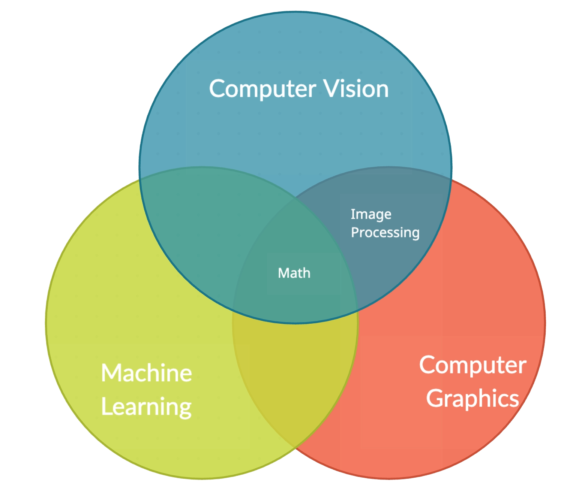

# Machine Learning Guidance

A collection of my *Machine Learning and Data Science Projects*, including both Theoretical and Practical (Applied) ML.

In addition, there are also references (paper, ebook, repo, tool, etc) that's interesting and helpful attached, ranging from beginner to advanced.

### ML Categories

**Generative Model**

- Joint Probability $P(x,y)$
  - Assume some functional form for $P(y)$, $P(x|y)$
  - Then, calculate $P(y|x)$ (via Bayes rule)
- Naive Bayes, HMM
  - Generate $X$ via $P(x|y)$ ✓
  - Not direct classification ✗

**Discriminative Model**

- Conditional Probability $P(y|x)$ 
  - Direct classification  ✓
- Logistic regression, SVM, NN

Reference: [Generative and Discriminative Model](http://ai.stanford.edu/~ang/papers/nips01-discriminativegenerative.pdf), Professor Andrew NG

| Output                                      | Unsupervised Learning                               | Supervised Learning                                 | Online Learning                        |
| ------------------------------------------- | --------------------------------------------------- | --------------------------------------------------- | -------------------------------------- |
| **Continuous**  $R$                 | ***Clustering &  Dim Reduction***      | ***Regression***                            | **Search &  Self-learning** |
|                                             | ○ SVD                                              | ○ Linear / Polynomial                              | Genetic Algorithm                      |
|                                             | ○ PCA                                              | ○ Non-Linear Regression                            | Reinforcement L                        |
|                                             | ○ K-means                                          | Decision Trees                                      |                                        |
|                                             | ○ GAN                                             | Random Forest                                       |                                        |
| **Discrete $C$   Categorical** | ***Association /  Feature Analysis*** | ***Classification***                        |                                        |
|                                             | ○ Apriori                                          | ○ Naive Bayes, Bayesian                            |                                        |
|                                             | ○ FP-Growth                                        | ○ Logistic Regression                              |                                        |
|                                             | Hidden Markov Model                                 | ○ SVM                                              |                                        |
|                                             |                                                     | ○ kNN / Trees ○ Perceptron ○ CNN  ○ RNN |                                        |

**Semi-Supervised Learning**

- uses a small portion of labeled data and lots of unlabeled data to train a predictive model
- iteratively generate pseudo-labels for a new dataset

**Reinforcement Learning**

- Markov Decision Process
- Q learning
- Value-based V(s)

  - the agent is expecting a long-term return of the current states under policy π
- Policy-based

  - the action performed in every state helps you to gain maximum reward in the future
  - Deterministic: For any state, the same action is produced by the policy π
  - Stochastic: Every action has a certain probability
- Model-based

  - create a virtual model for each environment
  - the agent learns to perform in that specific environment

### Feature Engineering

- Feature Selection
  - After fitting, plot Residuals vs any Predictor Variable
  - Linearly-dependent feature vectors
- Imputation
- Handling Outliers
  - Removal, Replacing values, Capping, Discretization
- Encoding
  - Integer Encoding
  - One-Hot Encoding (enum -> binary)
- Scaling
  - Normalization, min-max/ 0-1
  - Standardization

## My Projects

### Foundation of Machine Learning (naive NLP, Network)

*Machine Learning Real World Data, University of Cambridge IA*

[MLRD-Cambridge_IA](https://github.com/PeterHUistyping/Machine_Learning-Real_World_Data)

- Text Classification;
- Naive Bayes
- Cross-Validation, NLP
- HMM
- Social Network

### Theoretical Machine Learning

*Theoretical Machine Learning with Problems Sets, Stanford CS229*

[ML-Stanford_CS229](https://github.com/PeterHUistyping/Stanford_CS229.Machine_Learning)

- Basic Concepts
  - Linear classifiers (Logistic Regression, GDA)
  - Stochastic Gradient Descent
  - L1 L2 Regularization
  - SVM

### Computer Vision

| I\O                 | Image                     | Knowledge                |
| ------------------- | ------------------------- | ------------------------ |
| **Image**     | Image**Processing** | Computer Vision          |
| **Knowledge** | Computer Graphics         | Aritificial Intelligence |

*Theoretical Computer Vision with Problems Sets, Stanford CS231n*

[DL-for-CV-Stanford_CS231n](https://github.com/PeterHUistyping/Stanford_CS231n-Deep_Learning-for-Computer_Vision/)

- Image Classification (Supervised Learning, Discrete label)
  - kNN
  - Softmax
  - classifier SVM classifier
  - CNN
  - Cross Validation

### Case Exploration: Titanic Survival Prediction

[Titanic-ML-DataScience-Exploration](https://github.com/PeterHUistyping/Titanic-ML-DataScience-Exploration/)

- *Kaggle:Titanic Survival Prediction Exploration*
  - Updating ...

## Reference

### OpenAI cookbook

[📝OpenAI cookbook](https://platform.openai.com/docs/introduction)

### Generative Pre-trained Transformer (GPT) from Scratch ([Andrej Karpathy](https://github.com/karpathy/))

- [▶Youtube](https://www.youtube.com/watch?v=kCc8FmEb1nY)
  - [👨‍💻Code Github repo](https://github.com/karpathy/ng-video-lecture)
- [👨‍💻nanoGPT repo](https://github.com/karpathy/nanoGPT)

**Paper**

- [📄Attention is All You Need](https://arxiv.org/abs/1706.03762)
- [📄OpenAI GPT-3](https://arxiv.org/abs/2005.14165)
- [📝OpenAI ChatGPT blog post](https://openai.com/blog/chatgpt/)

## Library Used

Numpy, matplotlib, pandas, TensorFlow

Caffe, Keras

XGBoost, gensim
